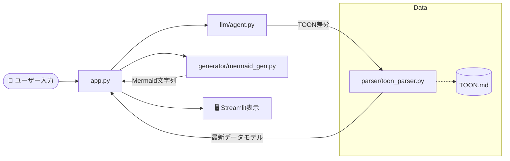

1ファイル1責任の原則（SRP）に基づき、各コンポーネントを独立させることで、**「AIの挙動を変えたいとき」**と**「図の見た目（Mermaid）を変えたいとき」**を完全に切り分けてメンテナンスできる構造を提案します。

---

## 1. 推奨されるフォルダ構造

拡張性と見通しの良さを重視した構成です。

```text
toon-flow-visualizer/
├── app.py                # 【Entry Point】StreamlitのメインUI・状態管理
├── core/                 # 【Logic】共通基盤・データ定義
│   └── models.py         # ノードやエッジのデータ構造 (Pydantic等)
├── parser/               # 【Responsibility: 解析】
│   └── toon_parser.py    # Markdown(TOON)から内部モデルへの変換
├── generator/            # 【Responsibility: 描画生成】
│   └── mermaid_gen.py    # 内部モデルからMermaid構文への変換
├── llm/                  # 【Responsibility: AI対話】
│   └── agent.py          # 大型LLMへの指示、TOON差分取得
├── schema/               # 【Assets】
│   └── template.md       # LLMに渡すTOONの基本テンプレート
└── data/                 # 【Storage】
    └── sessions/         # 保存されたTOONファイル(.md)

```

---

## 2. 各ファイルの責任範囲（要件定義）

### ① `core/models.py`

**責任：データの型定義**

* Pythonの `Dataclass` や `Pydantic` を使い、`Node` や `Edge` の属性（ID, Type, Label, Status）を厳密に定義します。
* ここを固定することで、他のファイル間でのデータの受け渡しミスを防ぎます。

### ② `parser/toon_parser.py`

**責任：TOONの解釈（ルールベース）**

* Markdown形式のTOONを正規表現（Regex）などでスキャンし、`models.py` で定義したオブジェクトのリストに変換します。
* **「差分（LOG）」の反映ロジック**もここに持ちます。古いスナップショットにLOGの内容を上書きして、最新の状態を作る責任者です。

### ③ `generator/mermaid_gen.py`

**責任：視覚化コードの出力（ルールベース）**

* `models.py` のオブジェクトを受け取り、規定した対応表に基づいて Mermaid 構文（`([ ])`, `{ }`など）の文字列を組み立てます。
* ノードの色付け（`style` 構文）の注入もここで行います。

### ④ `llm/agent.py`

**責任：AIとの意思疎通**

* 大型LLM（GPT-4o等）に対し、現在のTOONとユーザーの入力を渡し、**「新しいTOONの差分行」**を生成させます。
* プロンプトの管理もここで行います。

### ⑤ `app.py`

**責任：UI表示と状態のオーケストレーション**

* Streamlitの画面レイアウト。
* `st.session_state` を使い、ユーザーの入力を受けて `agent` → `parser` → `generator` の順に呼び出す司令塔です。

---

## 3. プログラムの動作フロー（図解）

1ファイル1責任を徹底することで、情報の流れが一本道になり、デバッグが容易になります。



---

## 4. この構造のメリット

* **交換可能性:** 「Mermaidではなく別の図解ライブラリを使いたい」と思ったら、`mermaid_gen.py` だけを書き換えれば済みます。
* **テストの容易さ:** AIがいなくても、`template.md` を `toon_parser.py` に読み込ませるだけで、図解ロジックが正しいかテストできます。
* **AIへの制約:** LLMには「`llm/agent.py` で決めた形式以外は出力するな」と厳しく教え込むことに集中できます。

---

## 次のステップ：具体的なコード実装

この構造で進めるにあたり、まずは一番の「心臓部」である **`core/models.py`（データの定義）** と **`generator/mermaid_gen.py`（Mermaidへの変換ルール）** のプロトタイプコードを書いてみましょうか？

ここが決まれば、システム全体の「背骨」が通ります。いかがでしょうか。