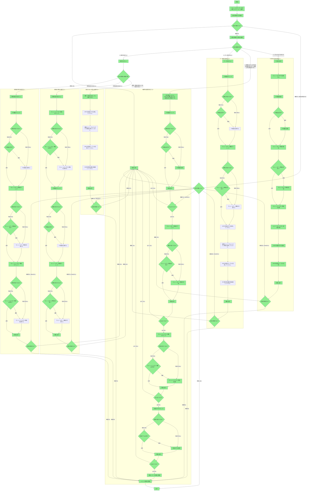

```mermaid
graph TD
    start["開始"]
    task1["モジュールをサンプル（異常なしモジュール）に交換"]
    task2["症状が再現するか確認"]
    decision1{"症状が再現するか？"}
    task3["症状が再現する場合の処理"]
    decision2{"症状の種類を判定"}
    task4["表示がおかしい"]
    decision3{"表示の問題の詳細を判定"}
    task5["両側の表示がおかしい"]
    task6["片側の表示がおかしい"]
    task7["両側・片側の対応をしても改善されない"]
    task8["データがおかしい"]
    task9["症状:再現しなかったJARVISを流動に戻したが、1週間以内に再度出てきた"]
    task_other["その他の症状"]
    task10["流動に戻す"]
    decision_recurrence{"症状が再発したか？"}
    node_end["終了"]
    
    %% メインフロー
    start-->task1
    task1-->task2
    task2-->decision1
    
    %% 再現しない場合
    decision1-->|"再現しない"|task10
    task10-->decision_recurrence
    decision_recurrence-->|"再発しない"|node_end
    decision_recurrence-->|"再発する（flow1から）"|decision1_1
    decision_recurrence-->|"再発する（flow2から）"|decision1_2
    decision_recurrence-->|"再発する（flow3から）"|decision1_3
    decision_recurrence-->|"再発する（flow4から）"|decision1_4
    decision_recurrence-->|"再発する（flow5から）"|decision9_1
    decision_recurrence-->|"再発する（flow6から）"|decision_other_1
    decision_recurrence-->|"再発する（最初の判定から）"|decision1
    
    %% 再現する場合
    decision1-->|"再現する"|task3
    task3-->decision2
    
    %% 症状の種類による分岐
    decision2-->|"1：表示がおかしい"|task4
    decision2-->|"2：データがおかしい"|task8
    decision2-->|"3：再現しなかったJARVISを流動に戻したが、1週間以内に再度出てきた"|task9
    decision2-->|"4：どれにも当てはまらない"|task_other
    
    %% メーカ・担当者への連絡（全モード共通）
    contact_manufacturer["メーカ・担当者に連絡"]
    
    %% 再現しなかったJARVISが1週間以内に再度出てきた場合の繰り返し処理フロー
    subgraph flow5 ["再発時の段階的対応フロー"]
        check9_1["PG基板をチェック"]
        decision_check9_1{"状態を判定できるか？"}
        decision_check9_1_1{"PG基板は正常か？"}
        task9_1["PG基板を交換"]
        task9_2["流動に戻す"]
        decision9_1{"また出てきたか？"}
        check9_3["モジュールボード基板をチェック"]
        decision_check9_3{"状態を判定できるか？"}
        decision_check9_3_1{"モジュールボード基板は正常か？"}
        task9_3["モジュールボード基板を交換"]
        task9_4["流動に戻す"]
        decision9_2{"また出てきたか？"}
        check9_5["モジュールコンタクト基板をチェック"]
        decision_check9_5{"状態を判定できるか？"}
        decision_check9_5_1{"モジュールコンタクト基板は正常か？"}
        task9_5["モジュールコンタクト基板を交換"]
        task9_6["流動に戻す"]
        decision9_3{"また出てきたか？"}
        check9_7["内部のFFCをチェック"]
        decision_check9_7{"状態を判定できるか？"}
        decision_check9_7_1{"内部のFFCは正常か？"}
        task9_7["内部のFFCを交換"]
        task9_8["流動に戻す"]
        decision9_4{"また出てきたか？"}
        task9_9["担当メーカ・担当者に連絡"]
        
        task9-->check9_1
        check9_1-->decision_check9_1
        decision_check9_1-->|"判定できる"|decision_check9_1_1
        decision_check9_1-->|"判定できない"|task9_1
        decision_check9_1_1-->|"正常"|task9_2
        decision_check9_1_1-->|"異常"|task9_1
        task9_1-->task9_2
        task9_2-->decision9_1
        decision9_1-->|"出てきた"|check9_3
        decision9_1-->|"出てこない"|task10
        
        check9_3-->decision_check9_3
        decision_check9_3-->|"判定できる"|decision_check9_3_1
        decision_check9_3-->|"判定できない"|task9_3
        decision_check9_3_1-->|"正常"|task9_4
        decision_check9_3_1-->|"異常"|task9_3
        task9_3-->task9_4
        task9_4-->decision9_2
        decision9_2-->|"出てきた"|check9_5
        decision9_2-->|"出てこない"|task10
        
        check9_5-->decision_check9_5
        decision_check9_5-->|"判定できる"|decision_check9_5_1
        decision_check9_5-->|"判定できない"|task9_5
        decision_check9_5_1-->|"正常"|task9_6
        decision_check9_5_1-->|"異常"|task9_5
        task9_5-->task9_6
        task9_6-->decision9_3
        decision9_3-->|"出てきた"|check9_7
        decision9_3-->|"出てこない"|task10
        
        check9_7-->decision_check9_7
        decision_check9_7-->|"判定できる"|decision_check9_7_1
        decision_check9_7-->|"判定できない"|task9_7
        decision_check9_7_1-->|"正常"|task9_8
        decision_check9_7_1-->|"異常"|task9_7
        task9_7-->task9_8
        task9_8-->decision9_4
        decision9_4-->|"出てきた"|task9_9
        decision9_4-->|"出てこない"|task10
        
        task9_9-->contact_manufacturer
    end
    
    %% メーカ・担当者への連絡（全モード共通）
    contact_manufacturer-->node_end
    
    %% 表示がおかしい場合の分岐
    task4-->decision3
    decision3-->|"両側の表示がおかしい"|task5
    decision3-->|"片側の表示がおかしい"|task6
    decision3-->|"両側・片側の対応をしても改善されない"|task7
    
    %% 両側の表示がおかしい場合の処理フロー
    subgraph flow1 ["両側表示異常の処理フロー"]
        check11_1["PG基板をチェック"]
        decision_check11_1{"状態を判定できるか？"}
        decision_check11_1_1{"PG基板は正常か？"}
        task11_1["PG基板を交換する"]
        check12_1["モジュールボード基板をチェック"]
        decision_check12_1{"状態を判定できるか？"}
        decision_check12_1_1{"モジュールボード基板は正常か？"}
        task12_1["モジュールボード基板を交換する"]
        check13_1["モジュールコンタクト基板をチェック"]
        decision_check13_1{"状態を判定できるか？"}
        decision_check13_1_1{"モジュールコンタクト基板は正常か？"}
        task13_1["モジュールコンタクト基板を交換する"]
        task10_1["流動に戻す"]
        decision1_1{"症状が再現するか？"}
        
        task5-->check11_1
        check11_1-->decision_check11_1
        decision_check11_1-->|"判定できる"|decision_check11_1_1
        decision_check11_1-->|"判定できない"|task11_1
        decision_check11_1_1-->|"正常"|check12_1
        decision_check11_1_1-->|"異常"|task11_1
        task11_1-->check12_1
        check12_1-->decision_check12_1
        decision_check12_1-->|"判定できる"|decision_check12_1_1
        decision_check12_1-->|"判定できない"|task12_1
        decision_check12_1_1-->|"正常"|check13_1
        decision_check12_1_1-->|"異常"|task12_1
        task12_1-->check13_1
        check13_1-->decision_check13_1
        decision_check13_1-->|"判定できる"|decision_check13_1_1
        decision_check13_1-->|"判定できない"|task13_1
        decision_check13_1_1-->|"正常"|task10_1
        decision_check13_1_1-->|"異常"|task13_1
        task13_1-->task10_1
        task10_1-->decision1_1
        decision1_1-->|"再現しない"|task10
        decision1_1-->|"再現する"|contact_manufacturer
    end
    
    %% 片側の表示がおかしい場合の処理フロー
    subgraph flow2 ["片側表示異常の処理フロー"]
        check13_2["モジュールコンタクト基板をチェック"]
        decision_check13_2{"状態を判定できるか？"}
        decision_check13_2_1{"モジュールコンタクト基板は正常か？"}
        task13_2["モジュールコンタクト基板を交換する"]
        check11_2["PG基板をチェック"]
        decision_check11_2{"状態を判定できるか？"}
        decision_check11_2_1{"PG基板は正常か？"}
        task11_2["PG基板を交換する"]
        check12_2["モジュールボード基板をチェック"]
        decision_check12_2{"状態を判定できるか？"}
        decision_check12_2_1{"モジュールボード基板は正常か？"}
        task12_2["モジュールボード基板を交換する"]
        task10_2["流動に戻す"]
        decision1_2{"症状が再現するか？"}
        
        task6-->check13_2
        check13_2-->decision_check13_2
        decision_check13_2-->|"判定できる"|decision_check13_2_1
        decision_check13_2-->|"判定できない"|task13_2
        decision_check13_2_1-->|"正常"|check11_2
        decision_check13_2_1-->|"異常"|task13_2
        task13_2-->check11_2
        check11_2-->decision_check11_2
        decision_check11_2-->|"判定できる"|decision_check11_2_1
        decision_check11_2-->|"判定できない"|task11_2
        decision_check11_2_1-->|"正常"|check12_2
        decision_check11_2_1-->|"異常"|task11_2
        task11_2-->check12_2
        check12_2-->decision_check12_2
        decision_check12_2-->|"判定できる"|decision_check12_2_1
        decision_check12_2-->|"判定できない"|task12_2
        decision_check12_2_1-->|"正常"|task10_2
        decision_check12_2_1-->|"異常"|task12_2
        task12_2-->task10_2
        task10_2-->decision1_2
        decision1_2-->|"再現しない"|task10
        decision1_2-->|"再現する"|contact_manufacturer
    end
    
    %% 両側・片側の対応をしても改善されない場合の処理フロー
    subgraph flow3 ["改善されない場合の処理フロー"]
        task14_1["JARVIS内部のFFCを交換してください。"]
        task15_1["裏側のユニバーサルコンタクト基板を交換してください。"]
        task16_1["JARVIS内部のケーブルを交換してください。"]
        task17_1["MK.Ⅱ(信号発生機)を再起動してください。"]
        task10_3["流動に戻す"]
        decision1_3{"症状が再現するか？"}
        task7-->task14_1
        task14_1-->task15_1
        task15_1-->task16_1
        task16_1-->task17_1
        task17_1-->task10_3
        task10_3-->decision1_3
        decision1_3-->|"再現しない"|task10
        decision1_3-->|"再現する"|contact_manufacturer
    end
    
    %% データがおかしい場合の処理フロー
    subgraph flow4 ["データ異常の処理フロー"]
        check11_3["PG基板をチェック"]
        decision_check11_3{"状態を判定できるか？"}
        decision_check11_3_1{"PG基板は正常か？"}
        task11_3["PG基板を交換する"]
        check12_3["モジュールボード基板をチェック"]
        decision_check12_3{"状態を判定できるか？"}
        decision_check12_3_1{"モジュールボード基板は正常か？"}
        task12_3["モジュールボード基板を交換する"]
        task14_2["JARVIS内部のFFCを交換してください。"]
        task15_2["裏側のユニバーサルコンタクト基板を交換してください。"]
        task16_2["JARVIS内部のケーブルを交換してください。"]
        task17_2["MK.Ⅱ(信号発生機)を再起動してください。"]
        task10_4["流動に戻す"]
        decision1_4{"症状が再現するか？"}
        
        task8-->check11_3
        check11_3-->decision_check11_3
        decision_check11_3-->|"判定できる"|decision_check11_3_1
        decision_check11_3-->|"判定できない"|task11_3
        decision_check11_3_1-->|"正常"|check12_3
        decision_check11_3_1-->|"異常"|task11_3
        task11_3-->check12_3
        check12_3-->decision_check12_3
        decision_check12_3-->|"判定できる"|decision_check12_3_1
        decision_check12_3-->|"判定できない"|task12_3
        decision_check12_3_1-->|"正常"|task14_2
        decision_check12_3_1-->|"異常"|task12_3
        task12_3-->task14_2
        task14_2-->task15_2
        task15_2-->task16_2
        task16_2-->task17_2
        task17_2-->task10_4
        task10_4-->decision1_4
        decision1_4-->|"再現しない"|task10
        decision1_4-->|"再現する"|contact_manufacturer
    end
    
    %% どれにも当てはまらない場合の処理フロー
    subgraph flow6 ["その他の症状の処理フロー"]
        task_other_1["モジュールとのFFCを交換する"]
        task_other_2["PG基板を確認"]
        decision_other_2{"PG基板は正常か？"}
        task_other_2_1["PG基板を交換"]
        task_other_3["モジュールボード基板を確認"]
        decision_other_3{"モジュールボード基板は正常か？"}
        task_other_3_1["モジュールボード基板を交換"]
        task_other_4["モジュールコンタクト基板を交換"]
        task_other_5["ユニバーサルコンタクト基板を交換"]
        task_other_6["JARVIS内部のFFCを交換"]
        task_other_7["JARVIS内部のケーブルを交換"]
        task_other_8["流動に戻す"]
        decision_other_1{"症状が再現するか？"}
        
        task_other-->task_other_1
        task_other_1-->task_other_2
        task_other_2-->decision_other_2
        decision_other_2-->|"正常"|task_other_3
        decision_other_2-->|"異常"|task_other_2_1
        task_other_2_1-->task_other_3
        task_other_3-->decision_other_3
        decision_other_3-->|"正常"|task_other_4
        decision_other_3-->|"異常"|task_other_3_1
        task_other_3_1-->task_other_4
        task_other_4-->task_other_5
        task_other_5-->task_other_6
        task_other_6-->task_other_7
        task_other_7-->task_other_8
        task_other_8-->decision_other_1
        decision_other_1-->|"再現しない"|task10
        decision_other_1-->|"再現する"|contact_manufacturer
    end
    
    style start fill:#90EE90
    style task1 fill:#90EE90
    style task2 fill:#90EE90
    style decision1 fill:#90EE90
    style task3 fill:#90EE90
    style decision2 fill:#90EE90
    style task4 fill:#90EE90
    style decision3 fill:#90EE90
    style task5 fill:#90EE90
    style task6 fill:#90EE90
    style task7 fill:#90EE90
    style task8 fill:#90EE90
    style task9 fill:#90EE90
    style task_other fill:#90EE90
    style task10 fill:#90EE90
    style decision_recurrence fill:#90EE90
    style node_end fill:#90EE90
    style task_other_1 fill:#90EE90
    style task_other_2 fill:#90EE90
    style decision_other_2 fill:#90EE90
    style task_other_2_1 fill:#90EE90
    style task_other_3 fill:#90EE90
    style decision_other_3 fill:#90EE90
    style task_other_3_1 fill:#90EE90
    style task_other_4 fill:#90EE90
    style task_other_5 fill:#90EE90
    style task_other_6 fill:#90EE90
    style task_other_7 fill:#90EE90
    style task_other_8 fill:#90EE90
    style decision_other_1 fill:#90EE90
    style check9_1 fill:#90EE90
    style decision_check9_1 fill:#90EE90
    style decision_check9_1_1 fill:#90EE90
    style task9_1 fill:#90EE90
    style task9_2 fill:#90EE90
    style decision9_1 fill:#90EE90
    style check9_3 fill:#90EE90
    style decision_check9_3 fill:#90EE90
    style decision_check9_3_1 fill:#90EE90
    style task9_3 fill:#90EE90
    style task9_4 fill:#90EE90
    style decision9_2 fill:#90EE90
    style check9_5 fill:#90EE90
    style decision_check9_5 fill:#90EE90
    style decision_check9_5_1 fill:#90EE90
    style task9_5 fill:#90EE90
    style task9_6 fill:#90EE90
    style decision9_3 fill:#90EE90
    style check9_7 fill:#90EE90
    style decision_check9_7 fill:#90EE90
    style decision_check9_7_1 fill:#90EE90
    style task9_7 fill:#90EE90
    style task9_8 fill:#90EE90
    style decision9_4 fill:#90EE90
    style task9_9 fill:#90EE90
    style check11_1 fill:#90EE90
    style decision_check11_1 fill:#90EE90
    style decision_check11_1_1 fill:#90EE90
    style check12_1 fill:#90EE90
    style decision_check12_1 fill:#90EE90
    style decision_check12_1_1 fill:#90EE90
    style check13_1 fill:#90EE90
    style decision_check13_1 fill:#90EE90
    style decision_check13_1_1 fill:#90EE90
    style task10_1 fill:#90EE90
    style decision1_1 fill:#90EE90
    style check13_2 fill:#90EE90
    style decision_check13_2 fill:#90EE90
    style decision_check13_2_1 fill:#90EE90
    style check11_2 fill:#90EE90
    style decision_check11_2 fill:#90EE90
    style decision_check11_2_1 fill:#90EE90
    style check12_2 fill:#90EE90
    style decision_check12_2 fill:#90EE90
    style decision_check12_2_1 fill:#90EE90
    style task10_2 fill:#90EE90
    style decision1_2 fill:#90EE90
    style task10_3 fill:#90EE90
    style decision1_3 fill:#90EE90
    style check11_3 fill:#90EE90
    style decision_check11_3 fill:#90EE90
    style decision_check11_3_1 fill:#90EE90
    style check12_3 fill:#90EE90
    style decision_check12_3 fill:#90EE90
    style decision_check12_3_1 fill:#90EE90
    style task10_4 fill:#90EE90
    style decision1_4 fill:#90EE90
    style contact_manufacturer fill:#90EE90
```
